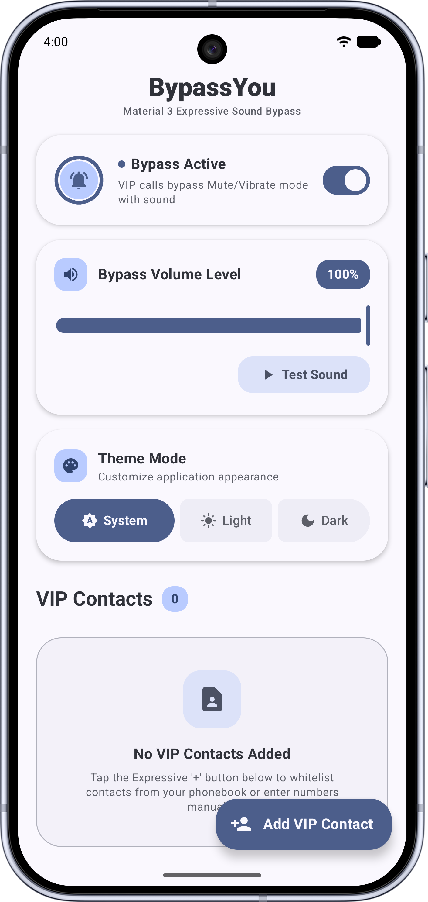
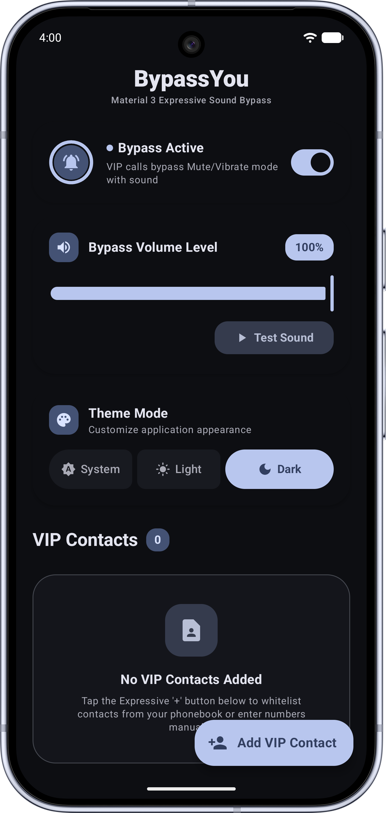

  # BypassYou

  **BypassYou** is an Android application built with **Jetpack Compose** and **Material 3 Expressive** design. It allows specified **VIP contacts** to bypass the phone's silent, vibrate, or Do Not Disturb (DND) modes with an emergency audible ringtone, ensuring you never miss critical calls.

  

    
    
    
    
    
  

  

    
  

  

    
  

---

## Screenshots

 &nbsp;&nbsp;&nbsp;&nbsp;&nbsp;&nbsp;&nbsp;&nbsp;&nbsp;&nbsp;

---

## Features

- **Non-Destructive Sound Bypass**: Plays alarms safely via `AudioAttributes.USAGE_ALARM` without altering or messing up system ringer/notification volume sliders on MIUI, OneUI, or AOSP.
- **Acoustic Loudness Curve**: Natural volume progression.
- **VIP Whitelist Management**: Add contacts directly from the system phonebook or enter numbers manually with format tolerance.
- **Material 3 Expressive UI**: Simple and clean user interface.
- **Background Reliability**: Integrated `CallScreeningService` (Android 10+) and persistent foreground service to prevent aggressive OEM background killing.

## Tech Stack

- **Language:** [Kotlin](https://kotlinlang.org/) (Coroutines, Flow)
- **UI Framework:** [Jetpack Compose](https://developer.android.com/jetpack/compose) with Material 3 Expressive
- **Storage**: Clean JSON-backed shared preferences repository with synchronization.

## License

BypassYou - Minimalist, bypass-the-sound-off application for Android.  
Copyright (C) 2026 bodyaant

This program is free software: you can redistribute it and/or modify it under the terms of the GNU General Public License as published by the Free Software Foundation, either version 3 of the License, or (at your option) any later version.

This program is distributed in the hope that it will be useful, but WITHOUT ANY WARRANTY; without even the implied warranty of MERCHANTABILITY or FITNESS FOR A PARTICULAR PURPOSE. See the GNU General Public License for more details.

You should have received a copy of the GNU General Public License along with this program. If not, see <https://www.gnu.org/licenses/>
